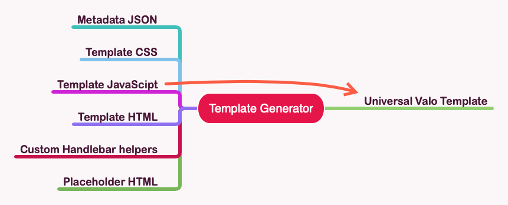

# Valo Template Generator

This is the Yeoman - Valo Template Generator which allows you to make template creation a lot easier. The generator splits each template in multiple pieces (SASS, TypeScript, HTML, JSON) and merge them during the build process.



## Installation

In order to get started, you will first have to install the following dependencies:

```shell
npm install -g yo @valo/generator-template
```

## Project creation

Open your command prompt in the folder where you want to create the template(s) and run one of the following commands:

```shell
# Start the yeoman generator. The generator will ask you a couple of questions.
yo @valo/template
```

### Questions

The following questions are asked:

- **Template name**: This name will be used as the file name of the template.
- **Include placeholder template**: This adds the `placeholder.html` file which you can use to generate the HTML for your placeholder.
- **Include custom Handlebars helper**: This will allow you to get the template for quickly starting with your custom Handlebars helper development.

### Command flags

The following flags can be used to speed up the project creation:

```shell
# -n: Provide the name of the template
yo @valo/template -n my-banner-template

# -p: Specify to include the placeholder template
yo @valo/template -n withhelper -p 

# -c: Specify to include the Handlebars helper
yo @valo/template -n withhelper -c

# Skip npm install at the end
yo @valo/template --skip-install

# Combining the flags is possible
yo @valo/template -n withhelper -p -c
```

## Usage

Once you created the project, you can start developing the template. In the template folder you will find the following files:

### Mandatory files

- `src/template/templatename/metadata.json`: the metadata you find at the beginning of your template, with JSON validation.
- `src/template/templatename/template.html`: the HTML of the template 

### Optional files

- `src/template/templatename/template.scss`: the styling of the template 
- `src/template/templatename/template.ts`: the typescript of the template
- `src/template/templatename/placeholder.html`: the HTML of the placeholder - only if you have specified the placeholder creation (you can always add it manually)
- `src/template/templatename/helper.ts`: The custom Handlebars helper - only if you have specified the custom Handlebars helper creation (you can always add it manually)

### Commands

In order to get you started there are two commands:

```shell
gulp build
```

> **Info**: This command lets you generate the HTML template. The template once generated can be found in the `~/dist/TemplatesGallery` folder.

```Shell
gulp sync --username <username>@<tenant>.onmicrosoft.com --password <password> --site https://<tenant>.sharepoint.com/sites/valotemplates
```

> **Info**: This command will automatically generate the HTML template and upload it to the Valo Template Gallery.

## Changelog

### 04/09/2020 - 1.0.0

- Initial version

## TODO List

- [] minify json, 
- [] minify HTML
- [] minify JavaScript
- [] minify CSS